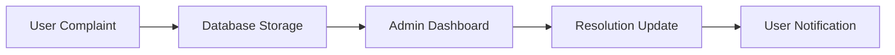
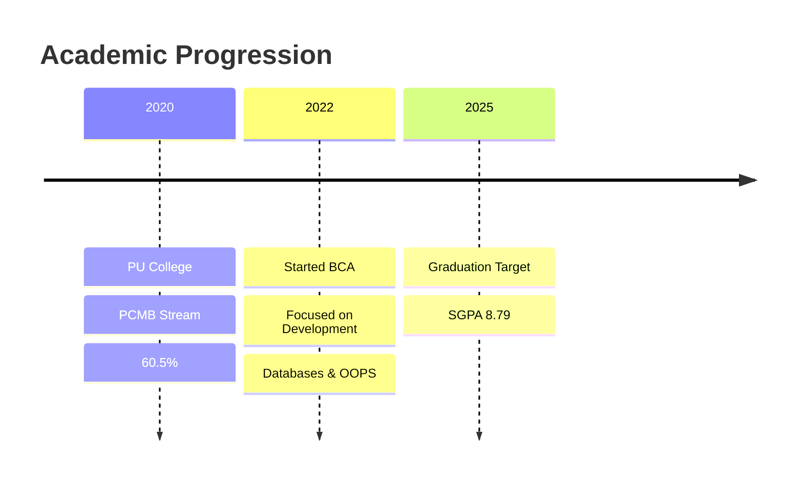

<div align="center">

# ⚡ KSHEERA.S.SHANUBHOGANAHALLi


<br/>


</div>

---

# 🖥️ Developer Command Center

<table>
<tr>
<td width="55%" valign="top">

```bash
> boot profile --user ksheera

[✓] Initializing developer profile...
[✓] Loading technical skills...
[✓] Connecting creativity module...
[✓] Problem-solving engine online...

SYSTEM STATUS:
------------------------------
Role      : BCA Student
Location  : Hosdurga, Chitradurga
Languages : Python, JavaScript, PHP, Java
Database  : MongoDB, MySQL
Mindset   : Creative + Analytical
Status    : Ready to Build 🚀
```

</td>

<td width="45%" valign="top">

## 📡 Connect Network

| Platform | Link |
|----------|------|
| 💼 LinkedIn | [Profile](https://linkedin.com/in/ksheera-s-shanubhoganahalli) |
| 📧 Email | [ksheerasshanubhoganahalli@gmail.com](mailto:ksheerasshanubhoganahalli@gmail.com) |
| 📱 Phone | +91-7259297419 |
| 🐙 GitHub | [GitHub Profile](https://github.com/ksheerasshanubhoganahalli-afk) |

---

## ⚙️ Current Mode

```yaml
learning: true
building: true
debugging: always
coffee_level: medium
motivation: 100%
```

</td>
</tr>
</table>

---

# 📊 Interactive Skill Matrix

<div align="center">

```text
PYTHON        ████████████████████░░   85%
JAVASCRIPT    ██████████████████░░░░   80%
PHP           ███████████████░░░░░░░   70%
JAVA          ████████████░░░░░░░░░░   60%
MONGODB       ████████████████████░░   90%
MYSQL         █████████████████░░░░░   78%
HTML/CSS      ███████████████████░░░   88%
ANGULAR JS    ██████████████░░░░░░░░   68%
GIT           ████████████████░░░░░░   75%
```

</div>

---

# 🧠 AI-Powered Developer Snapshot

<table>
<tr>
<td align="center" width="25%">

## 🔥
### Fast Learner

Adapts quickly to new technologies and frameworks.

</td>

<td align="center" width="25%">

## 🎯
### Problem Solver

Builds practical solutions with optimized workflows.

</td>

<td align="center" width="25%">

## 🌍
### Sustainability Focus

Interested in eco-friendly and impactful applications.

</td>

<td align="center" width="25%">

## 🚀
### Growth Mindset

Always improving coding standards and project quality.

</td>
</tr>
</table>

---

# 🛠️ Tech Universe

<div align="center">


</div>

---

# 🚀 Featured Projects Dashboard

<details open>
<summary><b>🧥 Online Cloth Rental System</b> <code>PHP • MongoDB • JavaScript</code></summary>

<br>

## 🌱 Project Vision
A sustainable fashion platform designed to simplify clothing rentals while promoting eco-friendly clothing reuse.

### ⚡ Smart Features
- 🔍 Advanced filtering for faster product discovery
- 📦 Automated booking and return tracking
- 🔐 Secure authentication system
- 📊 Admin analytics dashboard
- 📱 Responsive mobile-friendly interface

### 📈 Performance Impact

| Feature | Result |
|---------|--------|
| Catalog Filtering | 🚀 40% Faster Browsing |
| Inventory Automation | ⚙️ 70% Reduced Manual Work |
| User Experience | 📱 Fully Responsive |
| Sustainability | 🌍 Encourages Clothing Reuse |

### 🧩 Tech Stack

```text
Frontend  → HTML + CSS + JavaScript
Backend   → PHP
Database  → MongoDB
```

### 📂 Resources
- [View Repository](https://github.com/ksheerasshanubhoganahalli-afk) (Update with actual repo link)
- [Project Documentation](https://github.com/ksheerasshanubhoganahalli-afk) (Add if available)

</details>

---

<details>
<summary><b>📋 Online Complaint Registration System</b> <code>Vanilla JS • MongoDB</code></summary>

<br>

## 🎯 Objective
Digitize complaint management for faster and more transparent issue resolution.

### 💡 Key Innovations
- Real-time complaint tracking
- Lightweight responsive interface
- Admin-side complaint management
- Improved operational transparency

### 📊 System Workflow



### 📂 Resources
- [View Repository](https://github.com/ksheerasshanubhoganahalli-afk) (Update with actual repo link)
- [Live Demo](https://example.com) (Add if available)

</details>

---

# 📚 Education Analytics



---

# 📈 Productivity Graph

<div align="center">

```text
Coding        ████████████████████░░  90%
Problem Solving ██████████████████░░░ 85%
Creativity    ███████████████████░░░  88%
Communication ████████████████░░░░░░  75%
Teamwork      █████████████████░░░░░  80%
```

</div>

---

# 📊 GitHub Analytics

<div align="center">


</div>

<div align="center">


</div>

# 🧭 Developer Philosophy

> "Technology should not only solve problems — it should simplify lives, improve experiences, and create meaningful impact."

---

# ⚡ Fun Terminal

```bash
$ sudo apt install future-success

Reading package lists... Done
Building dependency tree... Done
The following NEW packages will be installed:
  creativity motivation discipline consistency

Setting up future-success (1.0) ...
✅ Success installed successfully.
```

---

# 📚 Useful Resources

- [Python Documentation](https://docs.python.org/)
- [JavaScript MDN Docs](https://developer.mozilla.org/en-US/docs/Web/JavaScript/)
- [MongoDB University](https://university.mongodb.com/)
- [Git Documentation](https://git-scm.com/doc)
- [GitHub Guides](https://guides.github.com/)

---

<div align="center">

# 🚀 OPEN TO INTERNSHIPS & COLLABORATIONS

[](https://linkedin.com/in/ksheera-s-shanubhoganahalli)
[](https://github.com/ksheerasshanubhoganahalli-afk)
[](mailto:ksheerasshanubhoganahalli@gmail.com)


</div>
